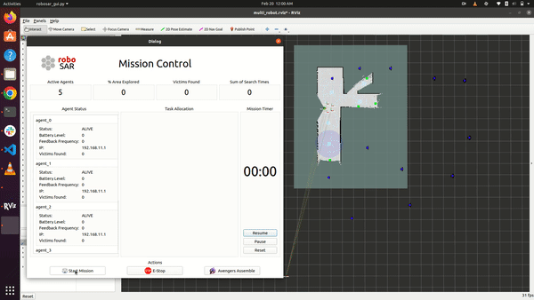

# RoboSAR - Autonomous Search and Rescue System
RoboSAR is an autonomous search and rescue system developed using the Robot Operating System (ROS) that uses a team of robots to explore and map an environment to search for victims. The system includes several subsystems, including a task generator, task allocator, multi-robot SLAM (MRSLAM), navigation among others. The system is also equipped with a user-friendly Mission Control GUI that allows users to monitor and interact with the system. The package also includes a multi-robot simulator based on the ROS Stage simulator for testing and debugging purposes. For more information about the RoboSAR project, please visit our [website](https://mrsdprojects.ri.cmu.edu/2022teamf/).

### Running the system
To run the RoboSAR system in simulation, you need to launch various ROS nodes. You can do this by running the following commands:
```bash
roslaunch robosar_agent_bringup robosar_agent_bringup_node.launch
roslaunch robosar_sim_bringup robosar_sim_[insert world name].launch
roslaunch slam_toolbox robosar_mapping_sim.launch
roslaunch robosar_task_generator task_generator.launch
roslaunch robosar_navigation mission_executive.launch
rosrun robosar_controller robosar_traffic_controller_node
rosrun robosar_task_allocator mission_commander.py -s=true -t="high"
python3 src/robosar/robosar_gui/src/robosar_gui.py
```
Once you've launched all of these nodes, you can start the mission by clicking on the "Start Mission" button in the GUI.

Here is the simulation run of the system in Tepper world

### Subsystems
Here is a brief overview of each subsystem in RoboSAR:

##### robosar_agent_bringup
This package is responsible for launching the hardware drivers for the robots. It initializes the robot hardware and establishes the communication between the robots and the rest of the system. This package is essential for the proper functioning of the RoboSAR system, as it ensures that the hardware is properly configured and ready for use.

##### slam_toolbox
This package provides SLAM (Simultaneous Localization and Mapping) functionality for the RoboSAR system. It uses sensor data from the robots to build a map of the environment and estimate the location of the robots within that map. This information is used by other subsystems of the RoboSAR system, such as the task allocator and navigation nodes, to plan and execute missions.

##### robosar_task_generator
This package is responsible for generating the tasks that the robots will perform during a mission. It creates both frontier and coverage tasks, which are then passed to the task allocator node. The task generator uses information from the SLAM node to identify areas of the environment that have not yet been explored or covered by the robots, and creates tasks based on that information. This package is important for ensuring that the robots are always working on tasks that are relevant to the overall mission objectives.

##### robosar_task_allocator
This package is responsible for assigning tasks to the robots during a mission. It uses an algorithm that takes into account task distance, utility, and information gain to assign tasks to the robots in an efficient and effective manner. The task allocator balances the need for exploration of new areas of the environment with the need to complete coverage tasks. This package is crucial for ensuring that the robots are working efficiently and effectively towards achieving the mission objectives.

##### robosar_navigation
This package is responsible for path planning for the RoboSAR system. It uses the map built by the SLAM node and plans paths for the robots to follow in order to complete all the tasks assigned to them. This package is responsible for ensuring that the robots have optimal paths without any collisions with the environment.

##### robosar_controller
This package is responsible for coordinating the movements of multiple robots in the system. It ensures that the robots do not collide with each other while performing their missions. This node monitors the positions and velocities of all the robots and sends commands to adjust their speeds and trajectories as necessary to avoid collisions. The robosar_controller ndoe is critical for the safe operation of the system, especially in scenarios where multiple robots are working in close proximity to each other.

##### robosar_gui
This package provides a graphical user interface (GUI) for monitoring and controlling the RoboSAR system. It displays real-time information about the status of the robots, the tasks being performed, and the progress of the mission. The GUI also allows the user to start and stop missions. This node is important for enabling human operators to interact with and manage the RoboSAR system.

##### robosar_sim_bringup
This package is used to launch the multi-robot simulator for testing and debugging the RoboSAR system before transferring it to real hardware. It is based on the ROS Stage simulator, which allows for the simulation of multiple robots in a 2D environment.

### Command to update all submodules
* git submodule update --init --recursive
* git submodule foreach git pull origin main

